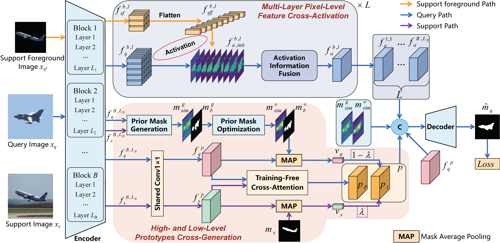

# FCA-HLP: Multi-Layer Feature Cross-Activation Network with High- and Low-Level Prototypes for Few-Shot Segmentation

> **Abstract:** Few-shot segmentation (FSS) aims to segment unseen categories with only a small amount of labeled images. Existing prototype learning and correlation learning methods are difficult to fully utilize the high- and low-level information of support and query images, resulting in unsatisfactory segmentation. In this work, we propose a multi-layer feature cross-activation (FCA) network with high- and low-level prototypes (HLP), which fully utilizes support and query information from both features and prototypes perspectives. Specifically, for the FCA module, we design a simple activation method that uses all the pixel-level support foreground features to activate query features, thereby obtaining activation maps without losing pixel-level support information. For the HLP module, we combine image-level prototypes with pixel-level prototypes to fully utilize high-level category information and low-level attribute information of support features. In addition, the prototype generation method integrates query information, which further enables the prototypes to better match target query features, especially when there are great differences between query and support images. Plenty of experiments on PASCAL-5<sup>i</sup> and COCO-20<sup>i</sup> under 1-shot and 5-shot settings prove the effectiveness of our FCA-HLP. The FCA-HLP also achieves new state-of-the-art. In addition, we also analyze the performance of the multi-layer feature cross-activation network without HLP module. The results prove that even without prototypes, the FCA module can still achieve good results.

<p align="middle">
  
</p>

### Dependencies

- RTX 3090
- Python 3.8
- PyTorch 1.12.0
- cuda 11.6
- torchvision 0.13.0
- tensorboardX 2.2


### Datasets

- PASCAL-5<sup>i</sup>:  [VOC2012](http://host.robots.ox.ac.uk/pascal/VOC/voc2012/) + [SBD](http://home.bharathh.info/pubs/codes/SBD/download.html)

- COCO-20<sup>i</sup>:  [COCO2014](https://cocodataset.org/#download)
- Put the datasets into the `FCA-HLP/data/` directory.
- Download the data lists from [BAM](https://github.com/chunbolang/BAM) and put them into the `FCA-HLP/lists` directory.
- Run `util/get_mulway_base_data.py` to generate base annotations and put them into the `FCA-HLP/data/base_annotation/` directory.

### Models

- Download the pre-trained backbones from [BAM](https://github.com/chunbolang/BAM) and put them into the `FCA-HLP/initmodel` directory. 
- Download the trained base learners from [BAM](https://github.com/chunbolang/BAM) and put them under `initmodel/PSPNet`. 


### Scripts

- Change configuration and add weight path to `.yaml` files in `FCA-HLP/config` , then run the `train.sh` file for training or `test.sh` file for testing.

### Performance

Performance comparison with the state-of-the-art approach ([BAM](https://github.com/chunbolang/BAM)) in terms of **average** **mIoU** across all folds. 

1. ##### PASCAL-5<sup>i</sup>

   | Backbone  | Method       | 1-shot                   | 5-shot                   |
   | --------  | ------------ | ------------------------ | ------------------------ |
   | ResNet50  | BAM          | 67.09                    | 71.25                    |
   |           | FCA-HLP(ours)| 68.22 <sub>(+1.13)</sub> | 72.32 <sub>(+1.07)</sub> |
   | VGG16     | BAM          | 64.17                    | 69.14                    |
   |           | FCA-HLP(ours)| 65.56 <sub>(+1.39)</sub> | 70.22 <sub>(+1.08)</sub> |
   

2. ##### COCO-20<sup>i</sup>

   | Backbone | Method       | 1-shot                   | 5-shot                   |
   | -------- | ------------ | ------------------------ | ------------------------ |
   | ResNet50 | BAM          | 46.02                    | 51.54                    |
   |          | FCA-HLP(ours)| 48.81 <sub>(+2.79)</sub> | 55.11 <sub>(+3.57)</sub> |
   | VGG16    | BAM          | 43.40                    | 48.77                    |
   |          | FCA-HLP(ours)| 44.47 <sub>(+1.07)</sub> | 50.21 <sub>(+1.44)</sub> |
   
   


## References

This repo is mainly built based on [PFENet](https://github.com/dvlab-research/PFENet), and [BAM](https://github.com/chunbolang/BAM). Thanks for their great work!

````
This paper is currently being reviewed by the IEEE Transactions on Artificial Intelligence journal
